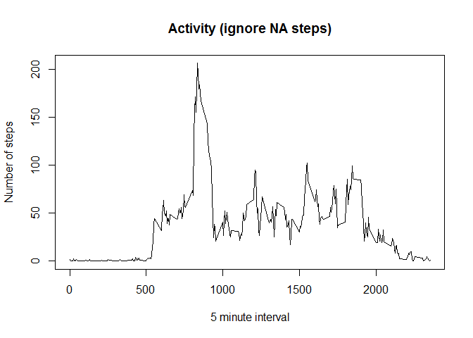

# Reproducible Research: Peer Assessment 1

*Notes to the graders*

I've been struggling with this assignment due to my lack of R experience. As such, I would appreciate any constructive comments on better techniques or to point out what you think may be blunders with possible corrections.  
I've avoided dplyr chaining for a reason in the following code chunks. I find that holding on to the tempoaries helps my understanding of R (again, my lack of R experience). Some of the temporaries I do cleanup since they just clutter up the namespace (file paths, etc)

In many cases, I've added more to the data tables than is requied (sum of steps, datetime, etc). This was done during my initial attempts to process this data and I've decided to leave it in place.

## Setup global options and load required libraries

Load required libraries (and install if needed). Assume that knitr does not need install. Setup function to convert interval to number of seconds base on the following formula.  
The interval digit works like this: the least signifcant 2 digits run from 0 - 55 (in minutes) and
the hours are reported as 100 to 2300 => (hour * 100). For example, the interval 
1105 is actually 11 hours and 5 minutes or 665 minutes into the day (1100 + 05 == 11 hours + 5 minutes == 665 minutes)

```r
library(knitr)
opts_chunk$set(echo = TRUE) #yes, I know this is default, but I wished to demo how to setup up global settings

if (require("dplyr", warn.conflicts=FALSE, quietly=TRUE) == FALSE)
{
    install.packages("dplyr")
    library(dplyr)
}

if (require("lubridate", warn.conflicts=FALSE, quietly=TRUE) == FALSE)
{
    install.packages("lubridate")
    library(lubridate)
}

if (require("lattice", warn.conflicts=FALSE, quietly=TRUE) == FALSE)
{
    install.packages("lattice")
    library(lattice)
}

intervalToMinutes <- function(x) {
    hours <- x %/% 100
    mins <- x - hours*100
    
    return (mins + hours*60)
}
```


## Loading and preprocessing the data

*Note that not all preprocessing is performed within this section. Specific grouping,a new column factor, and replacement of NA step rows  will be added later as needed for specific processing demands*

Assume that the current working directory holds the activity.zip file. First verify that the file has been unzipped and if not, do so

```r
file.local.path <- "activity.csv"

if (file.exists(file.local.path) == FALSE)
{
    unzip("activity.zip")    
}
```

Now read in the csv file

```r
rawdata <- read.csv(file.local.path, colClasses=c("integer","character","integer"), stringsAsFactors=FALSE) 

datatbl <- tbl_df(rawdata) #convert to dplyr data frame table

rm(rawdata, file.local.path)
```

Convert date field to POSIX, create a datetime column to hold date and time (interval) and create year-day column using factors. Two data tables will be held for later processing:

- **datatbl**  holds all rows including rows with NA steps 
- **datatbl_narm**  removes rows with NA steps

The following is performed on the data table:

1. add new columns datetime and year_day
1. calcuate the missing row count
1. remove the missing rows and store resulting table for later use

```r
datatbl <- mutate(datatbl, date = ymd(date), datetime = date + intervalToMinutes(interval), year_day = factor(yday(datetime)))

missing.rows <- is.na(datatbl$steps) #boolean vector with TRUE for missing rows

count.missing.rows <- sum(missing.rows) #count of missing rows (using: TRUE == 1, FALSE == 0)

datatbl_narm <- filter(datatbl, !missing.rows)
```

## What is mean total number of steps taken per day?


```r
datatbl_narm <- group_by(datatbl_narm, year_day)

steps.byday <- summarize(datatbl_narm, count = sum(steps)) #caluculate total count of steps per day

mean.steps.perday <- as.integer(mean(steps.byday$count)) #mean of steps per day (ignore NA rows)
median.steps.perday <- as.integer(median(steps.byday$count)) #median of steps per day (ignore NA rows)

hist(steps.byday$count, xlab="Steps per day", main="Total Steps per day (ignore NA)")
```

 

```r
datatbl_narm <- ungroup(datatbl_narm) #do not leave this data table grouped (for later analysis)
```

The histogram shows what appears to be a normal distrubution (but further analysis requried to explain what looks to be a slight skew). The mean total number of steps per day is 10766 and the median number of steps per day is 10765

## What is the average daily activity pattern?

A time series plot of 5-minute intervals per average steps taken is shown below.

```r
datatbl_narm <- group_by(datatbl_narm, interval) #group by interval 

#average daily activity pattern
interval_steps <- summarize(datatbl_narm, sum_steps = sum(steps), mean_steps = mean(steps))

plot(interval_steps$interval, interval_steps$mean_steps, type="l", xlab="5 minute interval", ylab="Number of steps", main="Activity (ignore NA steps)")
```

 

```r
#find maximum steps interval:
max.steps.interval <- which.max(interval_steps$sum_steps) #NOTE: this returns an index, not the 5 minute interval value

#verify
max.steps.verify <- interval_steps[max.steps.interval,]$sum_steps == max(interval_steps$sum_steps)

#what is the interval number?
max.steps.intervalID <- interval_steps[104,]$interval

max.steps.minutes <- intervalToMinutes(interval_steps[104,]$interval) #convert to number of minutes 
max.steps.hours <- round(max.steps.minutes/60,2) #convert to hours

datatbl_narm <- ungroup(datatbl_narm) #do not leave this data table grouped (for later analysis)
```

The 5 minute interval (on average over all days of data set ingoring NA steps) was the interval id 835. This id represents 515 minutes into the day or 8.58 hours into the day.

To verify the max steps interval, I compared the sum_steps to the max of the interval steps to get a **TRUE** result (see code chunk above under the *\#verify* comment)

## Imputing missing values

The missing NA steps values are replaces with the rounded mean steps per interval. This processing will replace the orignal datatbl that holds NA steps with a table that repaces the steps with an interval based average.

```r
datatbl <- group_by(datatbl, interval)

datatbl <- mutate(datatbl, steps = replace(steps, is.na(steps), as.integer(round(mean(steps, na.rm=TRUE)))))

no.na.verify <- sum(complete.cases(datatbl)) #verify no NA's

datatbl <- ungroup(datatbl) #do not leave this data table grouped (for later analysis)

datatbl <- group_by(datatbl, year_day)

interval_steps2 <- summarize(datatbl,sum_steps = sum(steps), mean_steps = mean(steps))

steps.byday2 <- summarize(datatbl, count = sum(steps)) #caluculate total count of steps per day

mean.steps.perday2 <- as.integer(mean(steps.byday2$count)) #mean of steps per day 

median.steps.perday2 <- as.integer(median(steps.byday2$count)) #median of steps per day 

hist(steps.byday2$count, xlab="Steps per day", main="Total Steps per day (replaced NA)")
```

 

```r
datatbl <- ungroup(datatbl) #do not leave this data table grouped (for later analysis)
```
The histogram shows what appears to be a normal distrubution (but further analysis requried to explain what looks to be a slight skew). The mean total number of steps per day is 10765 and the median number of steps per day is 10762

A comparison of the data with NA removed and with the NA steps replaced are shown in the following table shows a slight decrease when the NA steps are replaced by the interval average.

<table>
    <tr>
		<td>&nbsp;</td>
		<td><b>Mean</b></td>
		<td><b>Median</b></td>
	</tr>
	<tr>
		<td><b>ignore NA</b></td>
		<td>10766</td>
		<td>10765</td>
	</tr>
	<tr>
		<td><b>replace NA</b></td>
		<td>10765</td>
		<td>10762</td>
	</tr>
</table>


## Are there differences in activity patterns between weekdays and weekends?

Using the data table with the replaced NA steps (again, using a average per interval replacement stratagy) and grouping the data based on weekday or weekend, report the activy pattern.

```r
#told to use maybe weekdays() function, but wday works better (no text to parse)
weekday.factor <- factor(c("weekday","weekend"))

datatbl <- mutate(datatbl, dayOfWeek = if (wday(date)==1 || wday(date)==7) weekday.factor[2] else weekday.factor[1])

datatbl <- group_by(datatbl, interval)

#average daily activity pattern
interval_steps3 <- summarize(datatbl, sum_steps = sum(steps), mean_steps = mean(steps))

#xyplot( interval_steps3$sum_setps ~ interval_steps3$interval )#  , layout=c(1,2)) #plot with 2 panels
#plot(interval_steps3$interval,interval_steps3$sum_setps, type="l")

unique_intervals <- unique(datatbl$interval)

xyplot( interval_steps3$mean_steps ~ unique_intervals | weekday.factor, type="l", layout=c(1,2), xlab="intervals", ylab="mean steps", main="Activity compared to weekday versus weekend")
```

 
